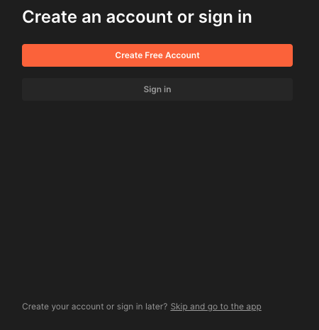
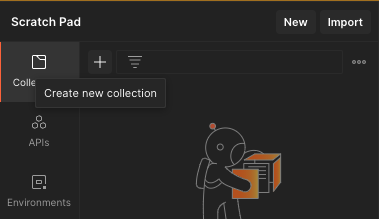
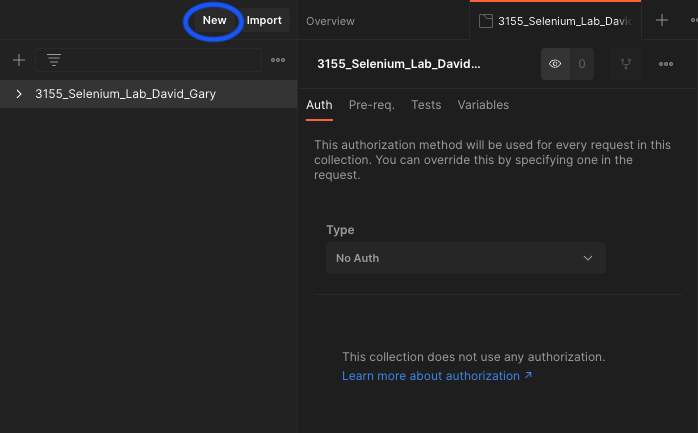
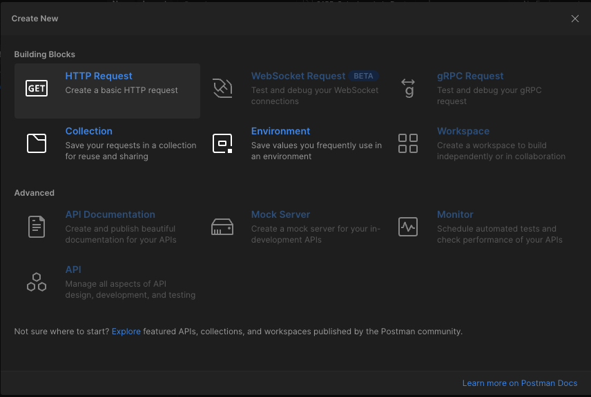
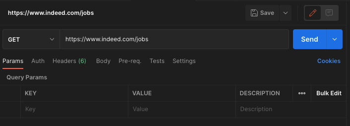
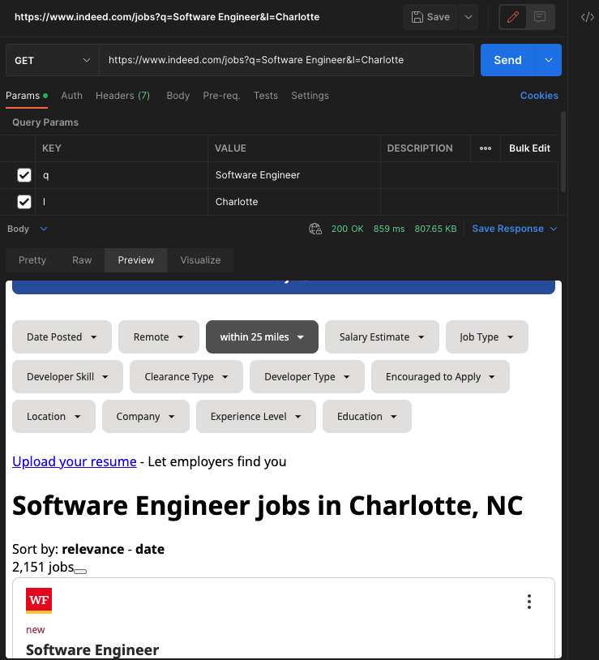
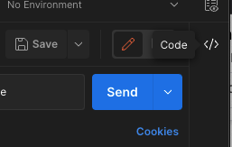

# Lab 5: Automated Workflows

## Introduction

In this lab, we will be using the application [Postman](https://www.postman.com/downloads/) to better understand the HTTP requests being made to the server. Postman is a tool that allows you to make HTTP requests to a server and see the response. It is a great tool for debugging and testing APIs. We will also set up the basic tools you need to start web scraping and automated interactions with web pages using the [Selenium](https://www.selenium.dev/) library. Lastly, we will go through a gentle introduction to [Docker](https://www.docker.com/), which is a tool that allows you to create and manage containers. Containers are packages that contain all dependencies, libraries, and files needed to run an application or service. Containers are meant to be lightweight, portable, and easy to deploy on any machine.

## Task 1: Installations

- Use `pip` to install all dependencies from `requirements.txt` as we did in previous labs.
- Download and install Postman from [here](https://www.postman.com/downloads/).
- Download the [ChromeDriver](https://chromedriver.chromium.org/downloads) for your operating system and the current version of Chrome (you can check your Chrome version by going to `chrome://settings/help` in your browser).
  - **HINT**: You might need to unzip the file after downloading it.
- Complete `TODO 1` by placing your ChromeDriver in the `chromedriver` folder in this lab.
  
## Task 2: Create New Collections and Requests in Postman

- Open the Postman application
  - **TIP**: You do not need to create an account. Select the `Skip getting started` option at the bottom.
  - 
- Select the `Create new collection` option in the left sidebar, and name it `3155_Selenium_Lab_Your_Name` (e.g., 3155_Selenium_Lab_David_Gary).
  - 

- Click the `New` button in the top left corner of the Postman window.
  - 
- Select the `HTTP Request` option.
  - 
- Enter "<https://www.indeed.com/jobs>" in the `Enter request URL` field and set it as a `GET` request.
  - 
- Add two key value pairs to the "Params" section of the request:
  - `q` with the value `Software Engineer`
  - `l` with the value `Charlotte`
- Click the "Send" button to send the request.
- Preview the response in the `Preview` tab, screenshot this, and save it for submission later in the lab.
  - 
- Import this as Python code using the `requests` library by clicking the `Code` button in the right sidebar and selecting `Python - requests` from the dropdown menu.
  - 
- Complete `TODO 2` by copying the code and pasting it to finish the `indeed_request` function of the `requesting.py` file.

## Task 3: Introduction to `requests` and `selenium`

- Complete `TODO 3` by simply running the `requesting.py` file and viewing the response.
- Complete `TODO 4` by simply running the `starter.py` file and viewing the response.

## Task 4: Finding the Information to Scrape

- Open the `search.py` file.
- Complete `TODO 5` in the `scrape_book_titles` function by using the `get` method built into the selenium driver to navigate to the Indeed website.
  - **HINT**: See `starter.py` for an example of how to use the `get` method.
- Complete `TODO 6` by using the correct method to find a group of elements on the page. The documentation for locating elements can be found [here](https://selenium-python.readthedocs.io/locating-elements.html).
  - **HINT**: For an example of how to find the correct element name, see this week's lab introduction video.
- Complete `TODO 7` by looping over the books on each page and using the correct methods to find and storing their **FULL** titles into the `book_titles` list.
  - **HINT**: The `get_attribute` method might be useful here, but you can also use the `text` attribute. See this [documentation link](https://selenium-python.readthedocs.io/api.html) for more information.

## Task 5: Docker Installation

- Complete `TODO 8` by installing Docker Desktop for your operating system:
  - [Windows](https://docs.docker.com/docker-for-windows/install/)
  - [Mac](https://docs.docker.com/docker-for-mac/install/)
  - [Linux](https://docs.docker.com/engine/install/)

## Task 2: A Simple Docker File

- Complete `TODO 9` by downloading the alpine image from Docker Hub by running the following command in your terminal:
  - `docker pull alpine`
- Navigate to the `docker` directory in your terminal.
- Complete `TODO 10` by creating a file named `Dockerfile` and adding the following content to it:
  - `FROM alpine`
  - `RUN apk add --update nodejs npm`
  - `RUN npm install -g http-server`
  - `WORKDIR /app`
  - `COPY . /app`
  - `EXPOSE 8080`
  - `CMD ["http-server", "-p", "8080"]`
- Complete `TODO 11` by building the Docker image by running the following commands in your terminal:
  - `docker build -t m5 .`
    - **NOTE:** The `.` at the end of the command is important. It tells Docker to look for the `Dockerfile` in the current directory.
  - `docker run -p 8080:8080 m5`
- If your Docker image was built successfully, you should be able to visit the following URL in your browser:
  - `http://localhost:8080`

## Task 3: Hosting a Docker Image on Docker Hub

- Complete `TODO 12` by creating an account on [Docker Hub](https://hub.docker.com/).
- Complete `TODO 13` by logging into Docker Hub by running the following command in your terminal:
  - `docker login`
  - **NOTE:** You may need to logout on your browser and through your terminal before logging in again.
    - to logout on your browser, click on your profile picture in the top right corner and click `Logout`
    - to logout through your terminal, run the following command: `docker logout`
- Complete `TODO 14` by tagging the Docker image by running the following command in your terminal:
  - `docker tag m5 <DockerHubName>/m5`
  - **NOTE:** Replace `<DockerHubName>` with your Docker Hub username (e.g., `docker tag m5 dgaryuncc/m5`)
- Complete `TODO 15` by pushing the Docker image to Docker Hub by running the following command in your terminal:
  - `docker push <DockerHubName>/m5`

## Submission Details

- On Canvas, submit the following:
  - The URL to your GitHub repository, with the latest version of your code pushed to the `main` branch.
  - **NOTE:** Comment on your submission with your Docker Hub username so that we can verify that you have pushed your Docker image.
  - Make sure that the TAs have been included as collaborators on your repository.
